# Super-Cashier_Project

# Latar Belakang
Dalam rangka mengembangkan bisnisnya, seorang pemilik supermarket ingin membuat sistem kasir self-service. Pada sistem ini, pelanggan dapat memasukkan daftar barang apa saja yang dibeli, jumlah dan harga per barang. Selain itu terdapat beberapa fitur lain yang dapat digunakan oleh pelanggan.

# Feature Requirements
1. Pelanggan dapat membuat ID transaksi.
2. Pelanggan dapat memasukkan nama barang, jumlah dan harga barang.
3. Jika terdapat kesalahan input seperti salah input nama barang, ingin menambah/mengurangi atau mengganti harga barang, pelanggan dapat memperbaiki kesalahan tersebut.
4. Jika pelanggan batal membeli suatu barang, pelanggan dapat menghapus barang tersebut dari daftar. Adapun jika pelanggan batal belanja di supermarket tersebut, pelanggan juga dapat membatalkan transaksi.
5. Pelanggan dapat mengecek daftar barang belanjaanya.
6. Pelanggan dapat menghitung total belanjaannya. Supermarket juga memberikan potongan harga kepada pelanggan dengan ketentuan sebagai berkut:
     - Jika total belanja pelanggan di atas Rp200.000, ia mendapatkan potongan 5%.
     - Jika total belanja pelanggan di atas Rp300.000, ia mendapatkan potongan 8%.
     - Jika total belanja pelanggan di atas Rp500.000, ia mendapatkan potongan 10%
  
# Diagram Alur
Berikut adalah diagram alur dari sistem self-service Super-Cashier ini.
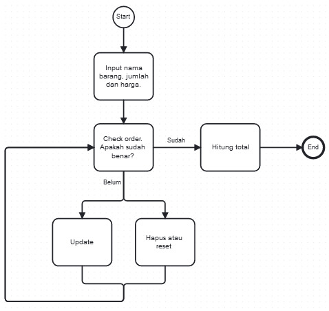

# Kode Program
Berikut adalah kode untuk class program ini beserta inisialisasinya. Sistem akan menampung setiap data yang diinput berdasarkan jenisnya datanya, seperti nama item, jumlah item, dan harga per item. Setelah itu data tersebut akan dirangkup dalam variabel order dalam bentuk dictionary.

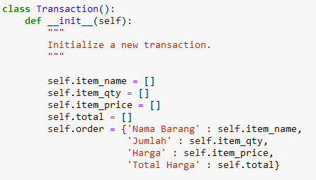

Selanjutnya, pelanggan dapat menambahkan item/barang dengan method berikut.

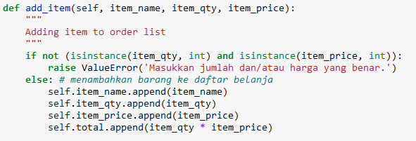

Jika, pelanggan ingin mengecek terlebih dahulu, apakah data yang diinput sudah sesuai, maka dapat menggunakan method berikut.

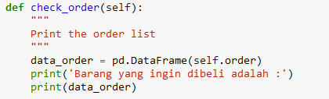

Apabila terdapat kesalahan input atau salah ketik, pelanggan dapat menggunakan fitur berikut
1. Update item name, dimana pelanggan dapat mengganti nama item.

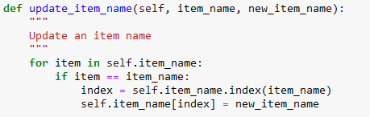   

2. Update item qty, dimana pelanggan dapat menambah atau mengurangi banyaknya suatu item.

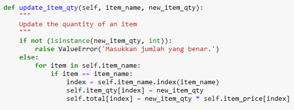

3. Update item price, dimana pelanggan dapat mengubah harga suatu item.

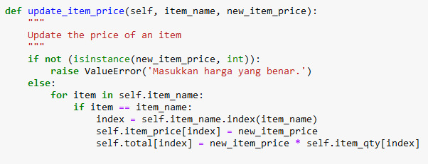

Selanjutnya, pelanggan juga dapat menghapus item tertentu atau membatalkan transaksi dengan fitur berikut.

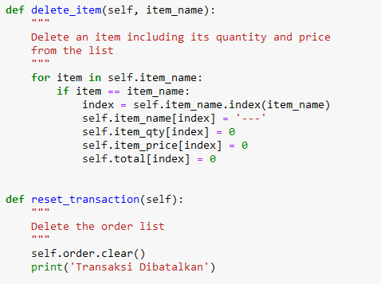

Terkahir, tentu saja sistem harus mampu menghitung total belanja seorang pelanggan beserta menghitung discountnya. berikut adalah kode untuk menghitung total belanja.

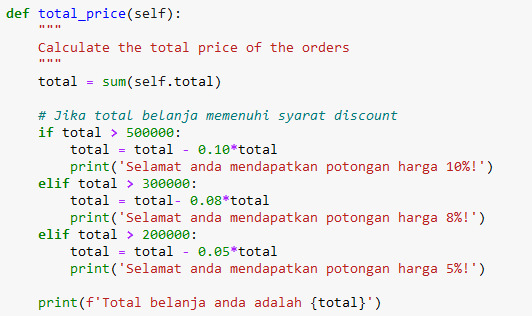

# Test Case
Kode dibawah ini berfungsi untuk mencetak daftar belanja beserta menampilkan total harga seorang pelanggan.

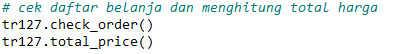

Misalkan pelanggan bernama Andi ingin membeli 3 pasta gigi seharga 15000, 1 sabun seharga 25000, dan 5 buku tulis.

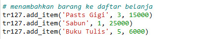

Maka,

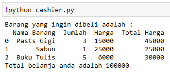

Ternyata terdapat beberapa informasi yang salah seperti salah ketik pada 'Pasts Gigi', kemudian Andi ingin menambah 1 sabun yang harganya 32000. Adapun Andi ingin mengganti produk buku tulis dengan produk yang harganyanya 7000.

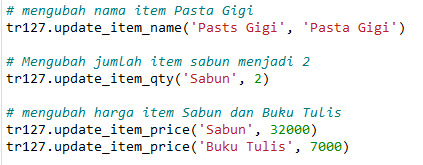

Maka, 

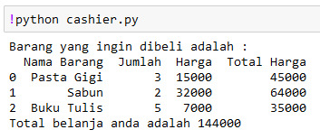

Setelah Andi cek lagi, dia belum membutuhkan Pasta gigi tapi ia membutuhka 3 buah lampu yang harganya 48000.

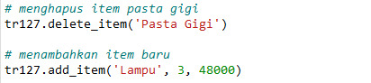

Setelah dirasa cukup, akhirnya Andi membeli dan membayar barang belanjaanya sebagai berikut.

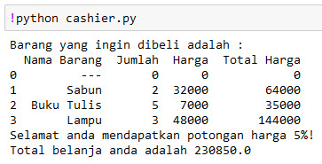

# Kesimpulan
